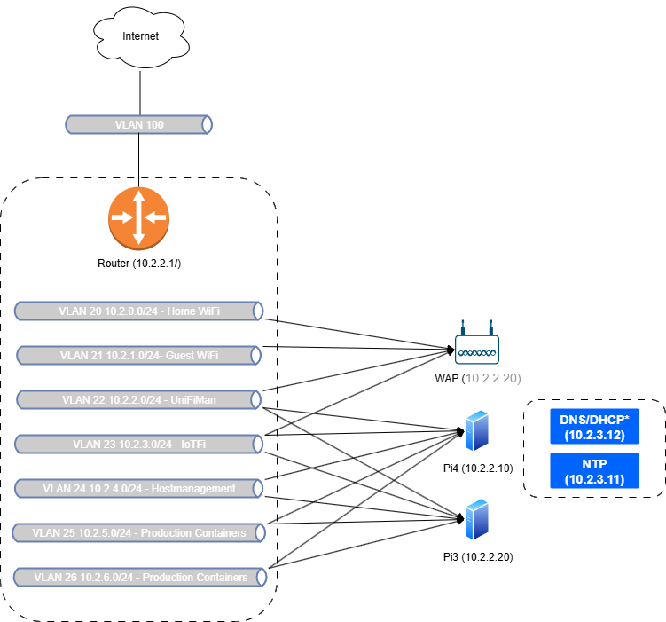

## 📊 Home Network Diagrams

### 1. 🖥️ Physical Network Diagram

**Purpose:** Show the actual hardware layout and connectivity of devices.

**Includes:**
- Router, switches, access points, servers (e.g., Raspberry Pi, AP)
- Physical ports used (e.g., trunk vs access)
- Cabling (Ethernet, fiber)
- Patch panels or PoE injectors (if applicable)

---

### 2. 🌐 Logical Network Topology

**Purpose:** This diagram shows the logical segmentaiton of my network.

**Includes:**
- VLANs and their purposes (e.g., IoT, Servers, Management, Guest)
- Subnets and IP ranges
- DNS/NTP services

---

### 3. 🐳 Docker Network Architecture

**Purpose:** Visualize how containerized services are structured and isolated.

**Should Include:**
- Docker networks (bridge, host, macvlan)
- Which services/containers live on each network
- Reverse proxy configuration (e.g., NGINX routing to internal services)
- Exposure to external IPs and ports

**Use Case:** Assists in debugging network issues, container isolation, and maintaining service security.

---

### 4. 🔐 Public Access / Reverse Proxy Flow

**Purpose:** Describe how external requests flow into the network and reach internal services.

**Should Include:**
- DNS resolution flow (Cloudflare → public IP → NGINX)
- SSL termination points
- Zero Trust or access control policies
- Port forwarding or NAT settings
- AuthN/AuthZ layers

**Use Case:** Critical for troubleshooting HTTPS issues, reverse proxy config, and understanding public attack surfaces.

--

### 5. 🛠️ CI/CD and Automation Flow

**Purpose:** Map out how infrastructure and services are deployed and updated.

**Should Include:**
- GitHub repository → GitHub Actions pipeline stages
- Terraform and Ansible deployment targets
- Staging vs production environment flow
- Update/rollback paths

**Use Case:** Helps understand the full DevOps lifecycle from commit to deployment, and improves automation design.

---

### 6. 🧱 Application Architecture Overview (Optional)

**Purpose:** Document the services you’re running, how they talk to each other, and where data flows.

**Should Include:**
- Services (e.g., Home Assistant, Grafana, Pi-hole)
- Databases, storage backends, APIs
- Authentication flows (e.g., OAuth, SSO)
- Backup targets

**Use Case:** Helps when scaling, updating, or rebuilding services.

---

### 7. 📦 Backup & Recovery Map (Optional)

**Purpose:** Show what’s backed up, how, and how recovery would work.

**Should Include:**
- Backup targets (config files, volumes, VM snapshots)
- Backup tools (e.g., restic, rsync, Borg)
- Storage locations (NAS, cloud)
- Recovery workflow

**Use Case:** Ensures reliability and reduces recovery time during a failure.