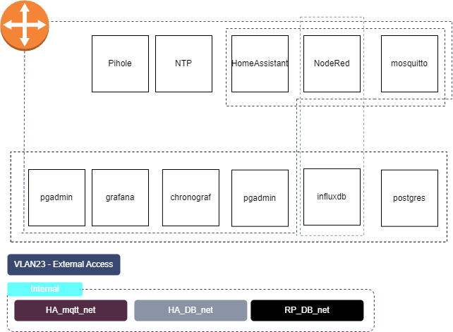

# Project Overview and Configuration Guide

This repository encapsulates the services deployed on my Raspberry Pi using Docker. It's designed to streamline Home Automation, Infrastructure Services, and Reporting into their own Docker Compose files with distinct network environments. Below, we provide an overview of each section and guidance on configuring and deploying the system.

## Home Automation (Folder: Home-automation)

### `docker-compose.yml`
This configuration orchestrates services for home automation using Docker Compose. It defines three internal networks (`HA_DB_net`, `HA_mqtt_net`, and `vlan23`) and allocates IP addresses for containers within the `vlan23` network. Key services include:

- **Node-RED:** A flow-based development tool for visual programming.
- **Mosquitto:** An MQTT broker for efficient communication.
- **Home Assistant:** An open-source platform for smart home automation.

## Infrastructure Services (Folder: inf-services)

### `docker-compose.yml`
The Infrastructure Services section focuses on essential services for network infrastructure. It utilizes the `vlan23` network and includes services like:

- **NTP (Network Time Protocol):** Ensures accurate timekeeping across devices.
- **Pi-hole:** A network-wide ad blocker with DHCP and DNS capabilities.

## Reporting (Folder: reporting)

### `docker-compose.yml`
This section concentrates on reporting and monitoring services, establishing multiple internal networks (`RP_DB_net`, `HA_DB_net`, and `vlan23`). It encompasses:

- **InfluxDB:** A high-performance, distributed, and scalable time-series database.
- **Chronograf:** A visualization and administrative interface for InfluxDB.
- **Grafana:** A flexible and powerful platform for analytics and monitoring.
- **PostgreSQL:** A robust, open-source relational database system.
- **pgAdmin:** A web-based administration tool for PostgreSQL.

## Network Diagram


## Getting Started

# Prerequisites

Before deploying the system, there are a few steps you need to follow:

## 1. Configure VLAN on Your Raspberry Pi

Make sure the VLAN is set up on your Raspberry Pi and ensure it is trunked through. Execute the following commands:

```bash
sudo ip link add link eth0 name vlan23 type vlan id 23
sudo ip link set dev vlan23 up
```

If you are not using VLANs, update the network configuration in the `docker-compose` file to 'eth0' instead of 'vlan23'.

## 2. Create a .env File

Create a `.env` file in each folder (`Home-automation`, `inf-services`, and `reporting`). You can use the examples provided as a reference.

## Deploying the System

Now that the prerequisites are in place, follow these steps to deploy the system:

1. Ensure Docker and Docker Compose are installed on your system.
2. Navigate to each folder (`Home-automation`, `inf-services`, and `reporting`).
3. Execute the following command to start the services:

```bash
docker compose up -d
```

This command launches the defined services in the background.

Enjoy your seamlessly orchestrated and containerized home automation, infrastructure services, and reporting system!

For detailed customization and troubleshooting, consult the official Docker and Docker Compose documentation:
- [Docker Documentation](https://docs.docker.com/)
- [Docker Compose Documentation](https://docs.docker.com/compose/)

Enjoy your seamlessly orchestrated and containerized home automation, infrastructure services, and reporting system!